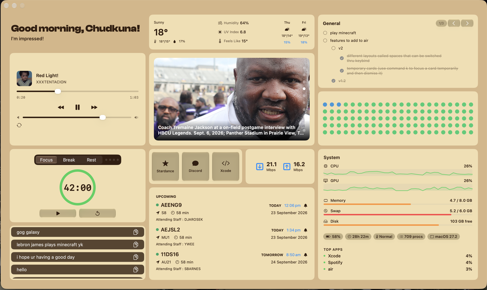

# air
Every morning I was bouncing between five apps just to check the weather and headlines before actually starting my day, and I didn't even have a to-do list. `air` puts all of it in one glance so you don't have to.

`air` is a lightweight, open-source desktop dashboard that collapses your morning clutter of weather, news, to-dos, and whatever else you could imagine into a glance.



## AI Declaration

Yes, I used AI models for this project. Specifically: in-line code completions to save time, and AudioManager used Gemini to help make. I used Claude to help me research how to find CPU, GPU and some memory stats in the System Stats card, but everything else in the project was done by me.

## Credits

My project uses Kirtan Shah's [nowplaying-cli](https://github.com/kirtan-shah/nowplaying-cli) to pull metadata from macOS's Now Playing system.

## What it does
`air` opens a card-based dashboard so you get the important stuff quickly instead of hunting through different apps. From factory release it includes:
- Weather (current conditions and a multi-day forecast)
- News (a feed of recent international headlines)
- To-Do List (a simple task list)
- Calendar (upcoming events at a glance, pulls from Apple Calendar)
- Streak (dot based habit tracker)
- Timer (countdown/pomodoro timer)
- Clipboard (recent clipboard history, doesn't show clipboard of connected iPhone)
- Bookmarks (quick links/app shortcuts)
- Audio Player (playback controls for media)
- Speed Test (internet speed test)
- System Stats (shows system statistics)

Cards are laid out on a grid and has settings, so you can configure the dashboard to show you what you care about.
## Built With
- Swift + SwiftUI
- SwiftData
- A small custom backend that serves weather, news, and speed test data
  - You can wire your own api, I just made my own for testing and it will most likely be up indefinetely
## Get Started
### Requirements
- Apple Silicon (M-series) Mac
- macOS Tahoe (26)
  - air uses liquid glass elements
- Associated Xcode
### Run it

Grab the latest `.dmg` from [Releases](https://github.com/dylankaru/air/releases), open it, and drag `air` into Applications.
> Note: since this isn't notarised, macOS Gatekeeper will warn on first launch, right-click the app -> Open to bypass it.

**OR**

1. Clone the repo
```bash
git clone https://github.com/dylankaru/air.git
cd air
```
2. Open `air.xcodeproj` in Xcode
3. Build and run (`⌘R`)

> Note: The Audio Player's "macOS Now Playing" source uses a bundled copy of `nowplaying-cli` — no separate install needed.

## Project Structure
```
air/
├── air/
│   ├── airApp.swift          # App entry point
│   ├── ContentView.swift     # Main dashboard layout & card grid
│   ├── cards/                # Each dashboard card (Weather, News, ToDo, ...)
│   │   └── settings/         # Per-card settings views
│   ├── utils/                # Shared managers (audio, JSON caching, API clients)
│   │   └── api/              # Networking layer for weather/news/speed test
│   └── Assets.xcassets/      # Icons, images, fonts
├── airTests/                 # Unit tests (i didnt really use this)
└── airUITests/               # UI tests (this too)
```

## Making Your Own Card
Designing your own card is simple as it only requires basic SwiftUI knowledge.
1. Create the view. For organisational sake, add it under `air/cards` , for example `MyCard.swift`. Wrap your content in the shared `Card` container so that it gets the standard corner radius, background, and can be rendered by the masonry:
```swift
   struct MyCard: View {
       var body: some View {
           Card {
               Text("Hi :)")
           }
       }
   }
```
2. (Optional) Add a settings view. If you design your card to be configurable, create a matching file in `air/cards/settings/`, for example `MySettingsView.swift`, following the pattern of the existing settings files.

3. When designing your cards, it would be better to follow these trends: card settings typically persist using UserDefaults (so `@AppStorage`), and card data is stored using the JSONManager and written either to `.cache` or `.applicationSupport`

4. Register the card. In `ContentView.swift`, the `appCards` array is where all cards are instantiated. `CardItem` accepts the following arguments: key, title, icon, colStart, colEnd, rowStart, rowEnd, minColSpan, minRowSpan, settingsView, and content (they also accept ignoreEdgePadding and ignoreStandardArrangements, but you're likely need not to use them).

```swift
CardItem(
  key: "myCard",
  title: "My Card", icon: "star.fill",
  colStart: 6, colEnd: 13, rowStart: 7, rowEnd: 10,
  settingsView: { MySettingsView() }
) {
  MyCard()
}
```
`title` and `icon` are only required if you pass a settings page. The grid is 20 columns wide and 14 rows tall, so pick a `colStart` and `colEnd` that fits comfortably alongside existing cards within this range.

5. Build and run. Your card should appear on the dashboard immediately, and its settings (if passed) will show up in the Settings window.

## Contributing
This is a personal project, but issues and pull requests are welcome if you'd like to add a card or fix a bug.
## License
MIT
